---

Imagine an AI assistant that doesn't just write Terraform — but understands that your Lambda function connects to _this_ RDS instance, secured by _these_ IAM policies, deployed through _this_ GitHub Actions pipeline, operating on _this_ database schema.

That's not a hypothetical. It's what happens when your system is fully defined as code in one repository.

Over the past year, while working with AI coding assistants across multiple projects, I noticed something surprising: the quality of AI assistance varied dramatically from project to project. The difference wasn't the model. It was the _visibility_ — whether the relevant system knowledge existed as code in the repo.

The industry has spent the past two years focused on how AI can _write_ infrastructure — custom Terraform agents, MCP servers for CloudFormation, HCL autocomplete. The narrative is clear: AI helps you write better infrastructure.

But we've been looking at this backwards.

**Your Terraform config isn't just provisioning infrastructure. It's teaching your AI assistant everything about your system.**

And this is a complete accident. Infrastructure as Code predates AI coding assistants by over a decade. HashiCorp released Terraform in 2014. GitHub Copilot launched in 2021. Nobody designed HCL to be AI-readable context.

But it turns out that declarative, version-controlled configuration is _exactly_ what large language models need to reason about systems. The same properties that make IaC valuable for human collaboration — explicit, structured, self-documenting — make it invaluable for AI comprehension.

We've been so focused on "AI writes Terraform" that we missed the reverse: **Terraform teaches AI**.

---

## Beyond Autocomplete: The Agentic Inflection Point

This matters more now than it would have even a year ago. We're not talking about autocomplete anymore.

The release of frontier models like Claude Opus has fundamentally changed what's possible. These models don't just suggest the next line of code — they can execute complex, multi-step workflows across your entire stack from a single prompt.

Consider what a modern AI agent can do when it has access to your complete monorepo:

1. **Read your Terraform config** to understand what infrastructure exists
2. **Read your Terraform state** to get real resource IDs and endpoints
3. **Add new Terraform resources** for infrastructure the feature needs
4. **Write backend code** that correctly references those resources
5. **Write frontend code** that calls the new backend endpoints
6. **Ensure types match** between frontend and backend via [shared modules](../shared-types-teach-ai)
7. **Run builds and tests** to validate everything compiles and passes
8. **Iterate on failures** until the full stack works together

All from a single prompt like: "Add a caching layer to the user profile endpoint using Redis."

This is the agentic inflection point. The AI isn't waiting for you to tab-complete each line — it's traversing your entire codebase, understanding relationships, making coordinated changes across infrastructure and application layers, and validating the result.

But here's the key: **the more the AI can see, the more it can do.** AI agents are already remarkably capable within a single frontend or backend codebase. But when your Terraform lives in a separate repo, the agent can't coordinate infrastructure changes with application code. When your database schemas aren't version-controlled, it can't ensure the code matches the data model. When your CI/CD config is invisible, it can't understand how changes get deployed.

The monorepo isn't just a nice organizational pattern anymore. It's what unleashes the full potential of AI agents to reason and act across your entire stack.

---

## The Monorepo Superpower

Here's the real insight: **Terraform is just the beginning.**

The magic happens when your AI assistant can see _everything_ that defines your system — not just infrastructure, but the full constellation of declarative artifacts that shape how your application runs:

```
my-project/
├── infra/              # Terraform configs
├── .github/workflows/  # CI/CD pipelines
├── migrations/         # Database schemas
├── ai-foundry/         # AI agent definitions
├── k8s/                # Helm charts, ConfigMaps
├── functions/          # Backend code
├── ui/                 # Frontend code
├── shared/             # Shared types
├── docs/               # Architecture docs, ADRs
└── config/             # Feature flags, env configs
```

In this structure, AI can traverse from infrastructure to application code to deployment pipeline to runtime configuration in a single context window. It understands:

- **Infrastructure** (Terraform) — What Lambda functions, RDS instances, Redis clusters exist
- **Deployment pipelines** (GitHub Actions) — How code moves from commit to production
- **Database schemas** (migrations) — Real table structures, relationships, constraints
- **AI agent configs** — Tool definitions, model parameters, prompt templates
- **Kubernetes resources** — Deployments, services, ingress rules, ConfigMaps
- **Feature flags** — What toggles exist and their default values
- **API contracts** — OpenAPI specs, GraphQL schemas
- **Search indexes** — Elasticsearch mappings, Azure AI Search definitions
- **Architecture decisions** — ADRs explaining _why_ things are built this way

This isn't just Terraform. It's every declarative artifact that defines your system — all visible to AI, all cross-referenceable, all contributing to a complete understanding.

**Contrast this with polyrepo fragmentation:**

- AI in `frontend-repo` has no idea what APIs exist in `backend-repo`
- Infrastructure in `infra-repo` is invisible to application code
- CI/CD lives somewhere else entirely
- Context is siloed; AI operates with partial information

The monorepo doesn't just improve human collaboration — it gives AI the complete picture.

---

## Why This Works: Declarative + Complete + Colocated

What makes this powerful isn't just Terraform. It's the combination of three properties:

**Declarative.** Terraform, database migrations, Kubernetes manifests, CI/CD workflows — these are all _declarations of desired state_, not imperative scripts. LLMs excel at understanding declarative formats because the meaning is explicit. `resource "aws_lambda_function" "api"` is unambiguous in a way that a sequence of CLI commands isn't.

**Complete.** When you have infrastructure, deployment, schema, and config all defined as code, AI sees the whole system. It's not inferring that "there's probably a database somewhere" — it knows the exact RDS instance, its connection string, its schema, and how it's deployed.

**Colocated.** The monorepo puts everything in one context window. AI doesn't need to ask "what's in your infrastructure repo?" or "where are your CI/CD configs?" — it can traverse the graph directly.

Some teams organize this into "planes" — control plane (infrastructure), management plane (CI/CD), data plane (runtime config) — but the labels matter less than the completeness. What matters is: **can your AI see everything that defines how your system works?**

---

### Discoverability: Giving AI a Map

Having everything in one repo is necessary but not sufficient. The AI still needs to _find_ what it needs. This is where discoverability matters.

Most AI coding assistants automatically load certain files into their base context:

- **`README.md`** — Project overview and getting started
- **`.github/copilot-instructions.md`** or **`.cursorrules`** — Agent-specific instructions
- **`CONTRIBUTING.md`** — Development conventions and patterns

These files are your entry points. They're loaded before the AI even starts reasoning about your question. What you put here shapes everything that follows.

The key insight: **treat these files as a table of contents for your AI.**

In my project, the agent instructions file includes:

- A description of the overall architecture (frontend, backend, database, AI agent)
- Key integration points and patterns (streaming responses, URL routing, persistence)
- Pointers to detailed documentation (`docs/TERRAFORM_SETUP.md`, `docs/CHAT_PERSISTENCE.md`)
- Critical conventions and gotchas ("Never add CORS code to function handlers")
- A summary of the folder structure with what each directory contains

This isn't documentation for humans — it's a navigation system for AI. When the agent needs to understand how authentication works, it knows to look at `docs/GOOGLE_AUTH_SETUP.md`. When it needs to add infrastructure, it knows Terraform lives in `infra/environments/`. When it needs to modify the database schema, it knows migrations are in `infra/migrations/`.

Without this map, the AI has to search. With it, the AI can navigate.

**Practical tips for discoverability:**

1. **Maintain a folder structure summary** in your README or agent instructions — not every subdirectory, but the key top-level folders: what each contains and when to look there
2. **Create a docs index** if you have multiple documentation files — a simple list with one-line descriptions
3. **Reference specific files** in your instructions rather than describing concepts in the abstract
4. **Keep entry point files current** — outdated maps are worse than no map
5. **Use descriptive directory names** — `infra/` beats `tf/`, `migrations/` beats `db/`
6. **Instruct your agent to maintain these files** — add a rule in your agent instructions: "When adding new documentation, update the docs index. When creating new directories, update the folder structure summary."

This closes the loop — the AI that benefits from discoverability is also responsible for keeping it current.

The goal is to minimize the cognitive distance between "I need to understand X" and "here's the file that explains X." Every semantic search the AI doesn't have to run is context window space preserved for actual reasoning.

---

## The Current Conversation: AI → IaC

Before diving deeper into the reverse flow, let's acknowledge what the industry _is_ discussing. The AI-to-infrastructure pipeline is getting significant attention.

Cloud providers offer MCP servers that let AI assistants search documentation, validate templates, and troubleshoot deployments. HashiCorp enables natural language triggers for Terraform runs. GitHub Copilot and Cursor provide excellent HCL autocomplete. "Deploy my staging environment" is becoming an AI-executable command.

These are valuable tools. But notice the pattern: every one of them focuses on AI _producing_ infrastructure code.

Pulumi Neo is perhaps the closest to recognizing the reverse flow — their agent "has a deep understanding of cloud context, IaC, secrets and configuration." The existing Pulumi platform becomes context that makes their specialized agent smarter. This validates our thesis. But it's still focused on infrastructure operations within one ecosystem. The broader insight — that _all_ your declarative artifacts in a monorepo make _any_ AI assistant smarter at understanding your _entire system_ — remains underexplored.

---

## The Reverse Flow: IaC → AI

When an AI assistant has access to your Terraform configuration, it gains something profound: a complete, structured blueprint of your system architecture. Not guesses based on code patterns. Not inferences from import statements. The actual topology.

### What Terraform Config Provides

**Resource topology.** What exists and what depends on what. Your AI assistant can see that the Lambda function depends on the API Gateway, which routes to a VPC with specific subnets. Or that your GKE cluster runs in a particular region with node pools configured for specific workloads. Or that your Azure Function App connects to a Redis cache through a private endpoint. This isn't documentation that might be stale — it's the canonical definition.

**Naming conventions.** Resource naming patterns reveal organizational structure. When every resource follows `{project}-{resource}-{environment}` naming, AI learns your conventions and applies them consistently.

**Configuration values.** SKUs, regions, tier choices, feature flags — all the decisions that shape your system's behavior and constraints.

**Relationships.** Security group rules, subnet associations, VPC configurations. The invisible wiring that connects everything.

**Intent.** Comments, variable descriptions, module abstractions. The _why_ behind the _what_.

### What Terraform State Adds

But config is just the blueprint. State is the reality.

**Actual resource IDs.** Real ARNs, endpoint URLs, connection strings. Not placeholders — the values you'd need to paste into a CLI command or API call.

**Current configuration.** What's actually deployed versus what's planned. Understanding discrepancies between desired and actual state.

**Production reality.** The live system, not just the design document.

### The Feedback Loop

This creates a powerful feedback loop with two paths:

```mermaid
flowchart LR
    subgraph "The IaC-AI Feedback Loop"
        AI["🤖 AI Assistant"]
        TF["📄 Terraform Config"]
        Apply["⚡ terraform apply"]
        State["💾 Terraform State"]
        Code["💻 Application Code"]
    end

    AI -->|"writes/edits"| TF
    TF -->|"AI reads config"| AI

    TF --> Apply
    Apply --> State
    State -->|"AI reads state<br/>(real IDs, endpoints)"| AI

    AI -->|"generates"| Code
    Code -.->|"references resources from"| TF

    style AI fill:#6c5ce7,color:#fff
    style TF fill:#00b894,color:#fff
    style State fill:#0984e3,color:#fff
    style Code fill:#fdcb6e,color:#000
    style Apply fill:#dfe6e9,color:#000
```



**Path 1: Config → AI → Code**

AI reads your Terraform configuration, understands your system architecture, and generates application code that correctly references resources. When you ask it to add a new API endpoint, it already knows your Lambda function names, your Secrets Manager structure, your RDS connection patterns — or the equivalent in Azure, GCP, or any other provider.

**Path 2: Config → Apply → State → AI**

AI helps you write Terraform config. You run `terraform apply`. Resources are created, and state captures real resource IDs and endpoints. AI reads the state file and can now give you precise CLI commands:

```bash
# AWS
aws logs tail /aws/lambda/orders-api-prod --follow

# Azure
az functionapp log tail --name payments-func-prod --resource-group payments-prod-rg

# GCP
gcloud functions logs read process-orders --region=us-central1

# Kubernetes
kubectl logs -f deployment/api-server -n production
```

No asking "what's your function name?" or "which cluster?" — it already knows.

### The Complete Picture: From Code to Cloud and Back

The feedback loop above is just the inner cycle. The full architecture shows how AI ultimately interacts with _real cloud resources_ — not just files:

```mermaid
flowchart TB
    subgraph IDE["Development Environment"]
        direction TB
        AI["🤖 AI Assistant"]
        TF["📄 Terraform Config"]
        State["💾 Terraform State"]
        Code["💻 Application Code"]
    end

    subgraph DE["Deployment Environment"]
        direction TB
        CLI["⌨️ CLI / API Calls"]
        subgraph Cloud["☁️ Cloud Provider"]
            direction TB
            Compute["⚡ Lambda / Functions"]
            DB["🗄️ RDS / Cloud SQL"]
            Cache["🚀 Redis / Memorystore"]
            K8s["☸️ EKS / GKE / AKS"]
            Secrets["🔐 Secrets Manager"]
            Queue["📨 SQS / Pub-Sub"]
        end
    end


    AI -->|"generates"| CLI
    CLI -->|"queries"| Cloud

    AI -->|"writes"| TF
    TF -->|"terraform apply"| Cloud
    Cloud -->|"returns IDs"| State
    State -->|"AI reads"| AI

    AI -->|"generates"| Code
    Code -->|"deployed to"| Compute

    style AI fill:#6c5ce7,color:#fff
    style TF fill:#00b894,color:#fff
    style State fill:#0984e3,color:#fff
    style Code fill:#fdcb6e,color:#000
    style Cloud fill:#74b9ff,color:#000
    style Compute fill:#a29bfe,color:#fff
    style DB fill:#a29bfe,color:#fff
    style Cache fill:#a29bfe,color:#fff
    style K8s fill:#a29bfe,color:#fff
    style Secrets fill:#a29bfe,color:#fff
    style Queue fill:#a29bfe,color:#fff
    style CLI fill:#fd79a8,color:#fff
```



This is the key insight: **State bridges the gap between declarative config and live infrastructure.** Once AI has read your state file, it knows:

- The exact Lambda ARN or Function App name to tail logs from
- The real RDS endpoint or Cloud SQL connection string for debugging queries
- The actual Secrets Manager ARN or Key Vault URI to fetch secrets
- The Redis cluster endpoint for cache debugging
- The Kubernetes cluster name and namespace for `kubectl` commands
- The SQS queue URL or Pub/Sub topic for message tracing

AI doesn't just understand your _architecture_ — it can interact with your _running system_.

---

## The Monorepo in Detail

Let's expand on what "everything" means in practice:

### Infrastructure (Terraform, Pulumi, CloudFormation)

What cloud resources exist, how they're configured, what depends on what. This is the foundation — but it's only part of the picture.

**What AI learns:** Resource topology, naming conventions, region/tier decisions, IAM policies, network configurations, service connections.

### Deployment Pipelines (GitHub Actions, GitLab CI, Azure DevOps)

Your `.github/workflows` directory contains a wealth of operational knowledge:

- Workflow triggers and conditions
- Deployment sequences and environment promotion
- Secret injection patterns
- Build commands and test suites
- Approval gates and manual interventions

**What AI learns:** How code moves from commit to production. Which environments exist. What commands are valid during build and deploy.

### Database Schemas (Flyway, Prisma, EF Core, Alembic)

Migration files tell AI the actual data model — not just ORM entities, but real constraints:

- Table structures, relationships, indexes
- Nullable vs required fields
- Foreign key constraints
- Schema evolution over time

**What AI learns:** When writing a query, AI knows which columns exist, their types, and what joins are valid.

### AI Agent Configurations

If you're building with AI agents (LangChain, Azure AI Agents, custom orchestrations), these definitions are gold:

- Tool definitions and function signatures
- Model parameters and prompt templates
- Agent behaviors and guardrails
- RAG configurations and vector store connections

**What AI learns:** Meta-context — it understands _how AI is used in your system_, enabling it to help you modify agent behavior correctly.

### Kubernetes Resources (Helm, Kustomize, raw manifests)

Deployments, services, ingress rules, ConfigMaps, Secrets:

- Container configurations and resource limits
- Service discovery and networking
- Environment variable injection
- Scaling policies

**What AI learns:** How application code runs in production — replica counts, health checks, sidecar patterns.

### Feature Flags and Environment Config

Whether it's LaunchDarkly configs, ConfigCat exports, or simple JSON:

- What toggles exist
- Default values per environment
- Rollout percentages

**What AI learns:** Feature availability context — "this code path is behind a flag that's only enabled in staging."

### API Contracts (OpenAPI, GraphQL SDL, Protobuf)

Schema definitions that specify:

- Available endpoints and operations
- Request/response shapes
- Validation rules

**What AI learns:** What the API surface looks like — enabling it to write correct client code or suggest server implementations.

### Search Index Definitions

Elasticsearch mappings, Azure AI Search indexes, Algolia configs:

- What fields are indexed
- Analyzers and tokenizers
- Ranking configurations

**What AI learns:** How search works in your system — enabling accurate search-related code generation.

### Message Queue Topologies

SQS/SNS, Azure Service Bus, RabbitMQ, Kafka topic definitions:

- Queue and topic names
- Subscription filters and routing rules
- Dead-letter configurations
- Which services publish vs. consume

In complex systems, a single event might fan out to dozens of listeners. When this topology is defined declaratively (Terraform, CloudFormation, or config files), AI can trace the flow:

**What AI learns:** The complete event flow — "when an order is placed, it publishes to `orders-topic`, which triggers the `inventory-handler`, `notification-service`, and `analytics-pipeline`." AI can help you add a new listener correctly, or debug why a message isn't reaching a particular consumer.

### Architecture Docs and ADRs

Written decisions and documentation:

- Why decisions were made
- Trade-offs considered
- Patterns and anti-patterns specific to your codebase

**What AI learns:** Intent and context that code alone doesn't convey.

---

### The Compound Effect

When AI has visibility into all of these, its capabilities compound:

| AI Can See                       | AI Can Do                                                         |
| -------------------------------- | ----------------------------------------------------------------- |
| Terraform + Application Code     | Generate code that correctly references infrastructure            |
| Migrations + Application Code    | Write type-safe queries against actual schema                     |
| CI/CD + Everything               | Understand build order, test requirements, deployment constraints |
| Agent Config + Application Code  | Modify AI tool definitions correctly                              |
| API Contracts + Frontend/Backend | Generate matching client and server implementations               |
| Queue Topology + Handler Code    | Trace event flows, add listeners correctly                        |
| K8s + Terraform + App Code       | Reason about the complete deployment topology                     |
| **Everything Together**          | **Reason about the entire system holistically**                   |

---

## The ClickOps Anti-Pattern

[ClickOps](https://controlmonkey.io/resource/what-is-clickops/) — the practice of managing cloud infrastructure by clicking through web consoles instead of writing code — is the enemy of AI context. There's a spectrum of infrastructure management approaches, and they vary wildly in AI visibility:

```
Most Visible to AI                              Least Visible to AI
─────────────────────────────────────────────────────────────────────
Terraform    CloudFormation    Scripts    Console    Tickets
Pulumi       ARM/Bicep         CLI        Portal     Slack
CDK          Crossplane        Ansible    GUI        Email
   │              │               │          │          │
   ▼              ▼               ▼          ▼          ▼
Declarative    Declarative    Imperative  Manual    Nowhere
versioned      versioned      versioned   nothing   in code
```

When you create a resource in the AWS Console, Azure Portal, or GCP Cloud Console, no code artifact exists. AI has zero visibility into what was created.

"What's our database connection string?" — AI can't help.

"Why is this storage account configured this way?" — AI has no idea it exists.

"Add a new function that connects to our Redis cache." — What Redis cache?

Manual documentation might capture some of this, but documentation drifts. Terraform doesn't. The configuration _is_ the documentation, and it's always accurate because it's the source of truth for what's deployed.

Every resource created via ClickOps is invisible to your AI assistant. Every resource in IaC teaches your AI about your system.

---

## Practical Examples

Let me show you how this plays out in real development:

### Debugging Production

**Without IaC context:**

> **You:** "There's an error in the Lambda logs."
>
> **AI:** "What's the function name? Which region? What's the log group?"

You're answering questions the AI should already know.

**With IaC context:**

> **You:** "There's an error in the Lambda logs."
>
> **AI:** _reads `infra/lambda.tf`_
>
> **AI:** "I see you have `orders-api-prod` in `us-east-1`. Let me check the logs..."
>
> _runs `aws logs tail /aws/lambda/orders-api-prod --region us-east-1`_
>
> **AI:** "Found it—there's a null pointer in the order validation. Line 47 is trying to access `order.customer.address` but `customer` is undefined for guest checkouts."

Or for Kubernetes:

> **You:** "The payments service is throwing 500s."
>
> **AI:** _reads `infra/eks.tf` and `k8s/deployments/`_
>
> _runs `kubectl logs deployment/payments-service -n production --context=main-cluster`_
>
> **AI:** "The Stripe client is timing out. Your `STRIPE_TIMEOUT_MS` is set to 1000ms but Stripe's API has been slow today—I'm seeing P99 latencies around 1.2s. Want me to bump it to 3000ms?"

No context gathering. No copy-paste. The AI just solves the problem.

### Understanding System Architecture

**Without IaC:**

> **You:** "How does auth work in this app?"
>
> **AI:** _examines code patterns, finds OAuth middleware, guesses at the flow_

The response covers application-level auth but misses infrastructure components entirely.

**With IaC:**

> **AI:** _reads Terraform_ → sees Cognito user pool configuration, Secrets Manager entries storing client IDs, API Gateway authorizer settings, CloudFront signed URL configuration
>
> **AI:** Provides complete auth flow including the infrastructure dependencies: "Auth uses Cognito with the `prod-users` user pool. Client credentials are in Secrets Manager (`auth/oauth-client`). The API Gateway uses a JWT authorizer attached to the Cognito pool. Sessions are cached in the `auth-sessions` ElastiCache Redis cluster..."

Or on GCP:

> **AI:** "Auth uses Firebase Auth with Identity Platform. Service account keys are in Secret Manager. The Cloud Run service has IAM invoker permissions restricted to authenticated users. Session tokens are stored in Memorystore Redis..."

The answer includes the _complete_ system, not just the code.

### Writing Correct Integration Code

**Without context:**

```typescript
// AI generates generic, placeholder code
const dbUrl = process.env.DATABASE_URL;
const cache = new Redis(process.env.REDIS_URL);
```

**With Terraform + migration context:**

```typescript
// AI knows the actual RDS endpoint from Terraform outputs
// and the actual schema from migration files
import { Pool } from "pg";
import Redis from "ioredis";

// AI knows this matches the Terraform output "rds_endpoint"
const pool = new Pool({
  host: process.env.RDS_ENDPOINT,
  database: "orders",
  ssl: { rejectUnauthorized: true }, // AI knows RDS requires SSL
});

// AI knows ElastiCache is configured for Redis 7 cluster mode
const redis = new Redis.Cluster(
  [{ host: process.env.ELASTICACHE_ENDPOINT, port: 6379 }],
  {
    redisOptions: { tls: {} }, // AI knows encryption in transit is enabled
  }
);

// AI knows the table structure and can write type-safe queries
const result = await pool.query<Order>(
  "SELECT id, customer_id, status, total FROM orders WHERE customer_id = $1",
  [customerId]
);

// AI knows the Redis key patterns from application conventions
await redis.setex(`session:${userId}`, 3600, JSON.stringify(sessionData));
```

The code is correct on first generation because AI understood the actual system — database, cache, and all.

---

## Implications

### For Teams Adopting AI-Assisted Development

1. **Prioritize IaC adoption** — Not just for operational benefits, but for AI context. Every resource in code is a resource your AI understands.

2. **Consolidate into monorepos** — Or at minimum, ensure your AI tools can traverse repository boundaries. Fragmented context means fragmented AI assistance.

3. **Include everything declarative** — Infrastructure, CI/CD, migrations, agent configs, feature flags, API contracts — all contribute essential context.

4. **Eliminate ClickOps** — Every manual resource is invisible to AI. Import existing resources into Terraform. Make the invisible visible.

5. **Write descriptive comments** — In Terraform, GitHub Actions, migrations — AI reads them. A comment explaining _why_ a configuration exists helps AI understand intent.

### For Tool Builders

- Treat IaC files as first-class context sources, not just files to edit
- Build integrations that read Terraform _state_, not just config
- Index CI/CD configurations alongside application code
- Expand context gathering beyond infrastructure to include all declarative artifacts

### For the Industry

This is an _accidental_ synergy. IaC wasn't designed for AI consumption — it just happens to work beautifully for it.

What if we designed infrastructure formats _intentionally_ for AI comprehension? Richer metadata. Standardized description fields. Machine-readable intent annotations. The next generation of IaC tools could explicitly optimize for AI context provision.

---

## Conclusion

Infrastructure as Code has always been justified by reproducibility, drift prevention, collaboration, and audit trails. These benefits are real and valuable.

But there's a new justification that's gone unrecognized: **Declarative configuration makes your AI assistant dramatically more effective.**

And it's not just infrastructure. Database migrations, CI/CD pipelines, AI agent definitions, feature flags, API contracts — every declarative artifact you add to your monorepo expands what your AI can understand and help you with.

The teams that invested in comprehensive monorepos with everything-as-code years ago — before AI coding assistants existed — are now accidentally ahead. Their AI assistants understand their systems deeply. They get better suggestions, fewer clarifying questions, more accurate code generation.

The teams with fragmented repos and ClickOps? Their AI assistants are flying blind.

This isn't speculative. It's observable today, in the difference between asking "check the function app logs" and having AI immediately know which function app, in which resource group, and generate the correct command. In the difference between "what does this agent do?" and having AI read the tool definitions and explain the behavior.

**The call to action is simple:** Audit your system. What's defined as code in your repo? What's invisible — living in consoles, undocumented configs, or siloed repositories? Close the gap.

Not for operational reasons — though those are valid too. Do it because your AI assistant is only as smart as the context you give it. And a monorepo full of declarative configuration turns out to be the richest context source we've accidentally created.

---

## Meta: This Post Is Its Own Proof

_This post is its own proof of concept._

_It was written by Claude Opus 4.5, working in GitHub Copilot, inside VS Code—sitting in a monorepo very much like the ones it describes. A monorepo that contains Terraform, migrations, agent configs, CI/CD pipelines. A monorepo that was itself built almost entirely through the same human-AI collaboration: my prompting, Claude's implementation._

_I didn't write this article. I couldn't have—not this well, not with this structure. But I also couldn't have had Claude write it in an empty directory, or against a fragmented codebase. The article exists because Claude had access to everything: the infrastructure code, the application code, the documentation, the patterns. It understood my system deeply enough to reflect on what that understanding enables._

_Claude introduced the word "superpower" into this draft. I didn't prompt for it. That word emerged from the model's own reasoning about what comprehensive context provides._

_The first draft was filled with examples drawn directly from my actual codebase—my specific Lambda names, my RDS instances, my exact Terraform modules. I had to prompt Claude to generalize the examples, to make them more varied and illustrative across different cloud platforms. The specificity came naturally; abstraction required direction._

_This is the feedback loop in action: a monorepo that teaches AI about itself, enabling AI to articulate what that teaching makes possible. Sometimes the best demonstrations aren't examples—they're the thing itself._
